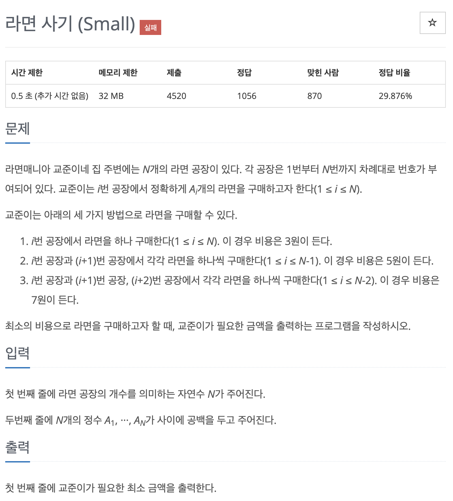

[백준 18185번 - 라면사기 (Small)](https://www.acmicpc.net/problem/18185)



~~"이게 정답률 29%?"~~

애초부터 그리디 필수 문제집에서 뽑은 문제고, 문제도 딱 봐도 그리디이다. 되게 쉬운 것 같았는데...

* 라면을 연속된 공장 3개에서 하나씩 총 3개를 구입하면 7원
* 라면을 연속된 공장 2개에서 하나씩 총 2개를 구입하면 5원
* 라면을 연속된 공장 1개에서 하나씩 총 1개를 구입하면 3원

붙어있는 공장들 중 최대한 3개로 살 수 있는 것들부터 조지고, 그 다음 2개, 그 다음 나머지 낱개로 구입하는 아주 기본적이고 간단한 접근으로 시작하였다. 

```
n = int(input())
c = list(map(int, input().split()))

price = 0
i = 0

print(c, price)

while i + 2 < len(c):
  minimum = min(c[i], c[i + 1], c[i + 2])
  if minimum != 0:
    c[i] -= minimum
    c[i + 1] -= minimum
    c[i + 2] -= minimum
    price += minimum * 7
    print(c, price)
  i += 1
i = 0

while i + 1 < len(c):
  minimum = min(c[i], c[i + 1])
  if minimum != 0:
    c[i] -= minimum
    c[i + 1] -= minimum
    price += minimum * 5
    print(c, price)
  i += 1
i = 0

while i < len(c):
  while c[i] != 0:
    c[i] -= 1
    price += 3
    print(c, price)
  i += 1

print(price)
```
위 코드를 실행하면 결과가 아래과 같다.
```
4
10 12 11 10
[10, 12, 11, 10] 0
[0, 2, 1, 10] 70
[0, 1, 0, 9] 77
[0, 0, 0, 9] 80
[0, 0, 0, 8] 83
[0, 0, 0, 7] 86
[0, 0, 0, 6] 89
[0, 0, 0, 5] 92
[0, 0, 0, 4] 95
[0, 0, 0, 3] 98
[0, 0, 0, 2] 101
[0, 0, 0, 1] 104
[0, 0, 0, 0] 107
107
```

*ㅋㅋ 근데 이렇게 쉽게 정답일리가 없었다.*

시간도 메모리도 널널하고 오류도 안나는데 정답이 틀린건 뭔가 예외가 있는 것 같은데.. 아무리 생각해도 그걸 찾지 못했다..

## 문제 해결

일단 조금만 비틀어 생각해봤어도 정답을 떠올릴 만 했을텐데, 문제를 풀 당시에는 '3개.. 3개...' 하고 있었기 때문에 눈치를 못 챘던 것 같다.

### case 분리

이 문제는 i가 진행해 나가면서 3개씩 한꺼번에 값을 빼게 되는데, 그런데 이때 **i+1이 i+2보다 클 경우** i, i+1, i+2를 하나씩 빼나가면 i와 i+2가 먼저 고갈되게 되고, 그러면 <u>i+1이 i+3과 고립되게 되어</u> price가 더 높게 책정된다. 그러므로 앞으로 진행해 나가는 걸 고려하여 i+1이 i+3이랑 고립되지 않도록 <u>2개씩 먼저 빼는 작업이 필요하다.</u>

1. **c[i + 1] < c[i + 2]일 때**
    이 때는 그냥 3개씩 빼나가면 된다.
2. **c[i + 1] > c[i + 2]일 때**
    이 때는 먼저 i, i+1 2개씩 빼주는 작업이 필요하다.
    근데 이제 2개씩 몇 번 빼주는 지도 고민을 해봐야했다.
    ~~'역시 다이아문제...'~~
    2-1. **c[i] > c[i + 1] - c[i + 2]일 때**
    c[i + 1]과 c[i + 2]의 차이가 c[i]보다 작을 때는 c[i + 1] - c[i + 2]만큼만 빼주면 c[i + 1]과 c[i + 2]값이 같아지고 이후 i, i+1, i+2에서 3개씩 구입하면 깔끔하게 i에 값이 0이 되고 다음 step으로 넘어갈 수 있다.
    2-2. **c[i] < c[i + 1] - c[i + 2]일 때**
    이때는 그냥 가능한만큼 c[i]와 c[i + 1]에서 2개씩 구입하면 i 값이 깔끔하게 0이 되고 앞으로 전진해나갈 수 있다.

이 순서대로 코드를 구현하게 되면 배열에서 3개씩 나아가면서 해결해나가는 방식이 되고, 1과 2가 if 와 elif, 그리고 남은 else는 고립된 하나의 라면 공장이 되기 때문에 *3을 해주면 되겠다.

### IndexError

i에서 i+1, i+2까지 함께 확인해가며 전진해나가는 코드인데, 이 경우 자꾸 실수해서 Indexerror가 떠서 화가 났는데, 의외로 해결법이 간단했다. 그냥 0,0을 추가로 넣어주면, i를 기준으로 해서 끝까지 for문으로 간단하게 해결할 수 있었다.

```
c = list(map(int, input().split())) + [0, 0]
```

### 정답
```
n = int(input())
c = list(map(int, input().split())) + [0, 0]
price = 0

print(c, price)
for i in range(n):
  if c[i+1] > c[i+2]:
    minimum = min(c[i], c[i+1]-c[i+2])
    c[i] -= minimum
    c[i+1] -= minimum
    price += minimum * 5
    print(c, price)

    minimum = min(c[i], c[i+1], c[i+2])
    c[i] -= minimum
    c[i + 1] -= minimum
    c[i + 2] -= minimum
    price += minimum * 7
    print(c, price)
  else:
    minimum = min(c[i], c[i+1], c[i+2])
    c[i] -= minimum
    c[i + 1] -= minimum
    c[i + 2] -= minimum
    price += minimum * 7
    print(c, price)

    minimum = min(c[i], c[i+1])
    c[i] -= minimum
    c[i + 1] -= minimum
    price += minimum * 5
    print(c, price)
  price += c[i] * 3
  print(c, price)
print(price)
```

```
4
10 12 11 10
[10, 12, 11, 10, 0, 0] 0
[9, 11, 11, 10, 0, 0] 5
[0, 2, 2, 10, 0, 0] 68
[0, 2, 2, 10, 0, 0] 68
[0, 0, 0, 8, 0, 0] 82
[0, 0, 0, 8, 0, 0] 82
[0, 0, 0, 8, 0, 0] 82
[0, 0, 0, 8, 0, 0] 82
[0, 0, 0, 8, 0, 0] 82
[0, 0, 0, 8, 0, 0] 82
[0, 0, 0, 8, 0, 0] 82
[0, 0, 0, 8, 0, 0] 82
[0, 0, 0, 8, 0, 0] 106
106
```

## 고찰
'이 문제가 다이아라고??'로 시작해서 결국 몇 시간을 소모했다. 뭐든지 쉬워보이게 하면 장인이랬듯이 쉬운 문제처럼 보인는데 생각보다 까다롭고 깔끔한 게 다이아 문제 클라스를 확인할 수 있었다.